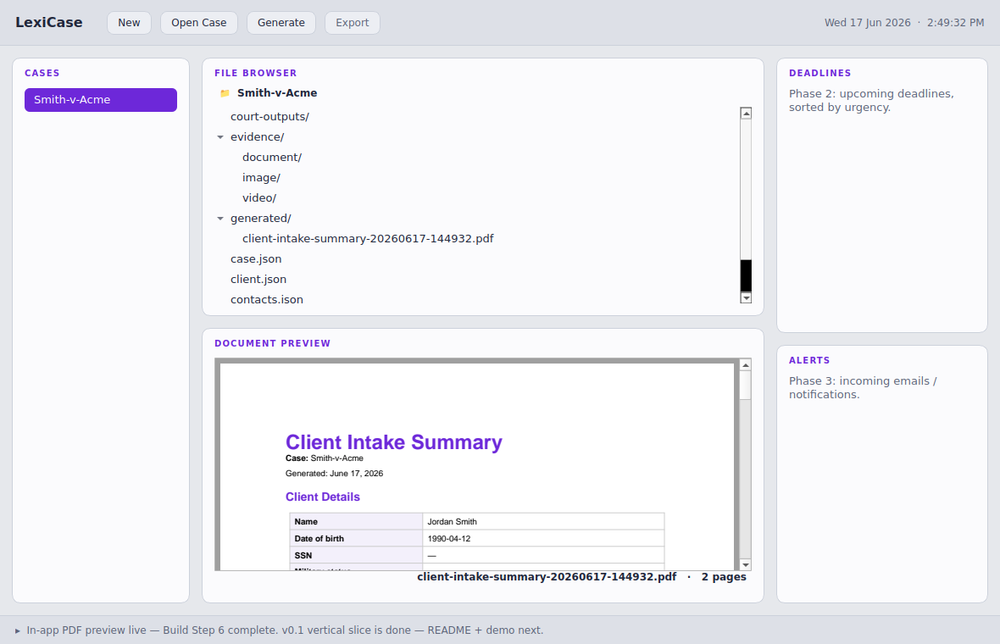

# LexiCase

**A local-first desktop app for running a legal case end to end** — structure the
case data, generate a court-ready document from it, organize evidence, and preview
it all in one window. Built in Python with PySide6. Every byte stays on your disk:
no cloud, no server, no account.

## Why I built this

I built LexiCase to run my own legal case work — turning a stack of handwritten
notes into a real desktop tool instead of wrestling with folders and Word files.
It's a personal project: organize cases, generate the documents I actually need,
and keep deadlines in front of me. I made it to scratch my own itch and to get
sharper at shipping real software end to end.



## What it does (v0.1)

- **Cases as folders.** Each case is a plain folder of JSON + files on disk — portable, inspectable, yours.
- **Structured forms.** Edit the client and defendant forms in-app; they round-trip to JSON.
- **Document generation.** Produce polished **PDFs** from case data — client intake summary, defendant information sheet, or case summary — via a picker.
- **In-app preview.** PDFs *and* evidence images render right in the dashboard, with a filename/size footer.
- **Export.** Zip an entire case to a single shareable archive.
- **Deadline tracking.** Per-case deadlines, sorted and color-coded by urgency (overdue / due-soon / upcoming) — and folded into the case summary document.
- **Case-aware file browser.** Navigate any case's forms, evidence, court outputs, and generated docs.

## Run it

Three commands, from the project folder:

```bash
python -m venv .venv && source .venv/bin/activate   # Windows: .venv\Scripts\activate
pip install -r requirements.txt
python main.py
```

To create a sample case to play with:

```bash
python tools/check_data_layer.py
```

## Architecture — the one rule

The UI talks to case data **only** through `app/case_api.py`. It never reads or
writes files, never touches `reportlab`, never knows where a case lives on disk.
That single seam is why each feature slotted in without rewrites:

```
main.py                  entry point; applies the theme app-wide
app/
    main_window.py       the dashboard shell + interactions
    case_api.py          THE SEAM — the only doorway to disk
    schemas.py           the shape of case data, versioned (one source of truth)
    form_editor.py       data-driven form, generated from the schema spec
    documents.py         builds the PDF from case data (swappable templates)
    theme.py             LIGHT/DARK palettes + QSS builder
tools/
    check_data_layer.py  self-test that also seeds a sample case
docs/
    screenshot.png
```

A case on disk:

```
workspace/Smith-v-Acme/
    case.json   client.json   defendant.json   contacts.json
    evidence/{document,image,video}/   court-outputs/   generated/
```

## Design decisions

- **Local-first.** Sensitive PII (SSNs, incident statements) never leaves the machine; `workspace/` is git-ignored.
- **JSON as the canonical layer.** Forms write JSON; documents render from JSON. One source of truth, easy to transfer and version (`schemaVersion`).
- **PDF output.** Universal — opens in any browser on any OS with nothing installed. The right format for finished, shareable legal documents. (Generation lives behind the seam, so other formats can be added as templates.)
- **Themed, not OS-dependent.** Forces the Fusion style + explicit palette so the look is identical regardless of the user's system theme.

## Tech

Python 3 · PySide6 (Qt for Python) · reportlab (PDF) · QtPdf (in-app rendering)

## Roadmap

- **v0.1 (done):** case model · file browser · forms ⇄ JSON · PDF generation · in-app preview
- **v1.1 (done):** 3 document templates + picker · in-app image preview · export to .zip
- **v1.2 (done):** deadline tracker, color-coded by urgency
- **Next:** case roster (active/closed) · an all-cases "what's due everywhere" view
- **Phase 3:** incoming-comms alerts (email/voicemail/fax) · reference data (county finder, legal codes)

## Demo (30 seconds)

1. Launch, click **New**, name a case.
2. Double-click `client.json` → fill in a few fields → **Save**.
3. Click **Generate** → a PDF appears under `generated/` and renders in the preview pane.
4. Double-click any `.pdf` in the browser to preview it in-app.
